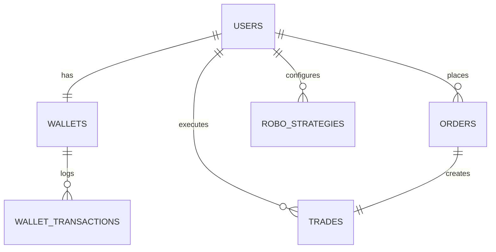

# FinNexus – Java Full Stack Forex Trading Platform (CDAC-Ready)

FinNexus is a TradingView-inspired forex trading simulation platform built strictly with Java 17 + Spring Boot (REST) + React. It includes manual trading, robo strategies, wallet management, and analytics, designed for CDAC submissions and interview defense.

## Highlights
- TradingView-style candlestick charts with live-like market feeds
- Manual trading engine (market/limit orders) with margin checks
- Robo-trading strategies (MA Crossover, RSI)
- Wallet & fund management with transaction ledger
- P&L analytics (open/closed, ROI, accuracy)
- JWT-based authentication & role-based admin
- Clean layered architecture with DTOs, services, repositories

## Tech Stack
Backend
- Java 17, Spring Boot (REST)
- Spring Security + JWT
- Spring Data JPA (Hibernate)
- MySQL
- Maven

Frontend
- React (Functional Components)
- Axios
- React Router
- TradingView Lightweight Charts (candlestick rendering)

## Folder Structure
```
/FinNexus
  /backend
    /src/main/java/com/finnexus
      /config
      /controller
      /domain
      /exception
      /repository
      /security
      /service
      /util
    /src/main/resources
  /frontend
    /src
      /api
      /components
      /context
      /pages
      /styles
  /database
    schema.sql
    seed.sql
```

## Backend Architecture (Layered)
- Controller: REST APIs only
- Service: business logic (trading engine, P&L, strategies)
- Repository: JPA access
- DTOs: request/response models
- Security: JWT + Spring Security filter chain

## Core Modules (Summary)
1. Authentication & Security
- `/api/auth/register`, `/api/auth/login`
- JWT issued on login/registration
- Role-based access for admin endpoints

2. Market Data & Charting
- `/api/market/candles` + `/api/market/quote`
- Live-like mocked market stream (random walk)

3. Manual Trading Engine
- `/api/orders` (market/limit)
- Margin validation & trade execution

4. Robo Trading
- `/api/strategies` CRUD
- `/api/strategies/run` executes strategies and auto-orders

5. Wallet & Fund Management
- `/api/wallet`, `/api/wallet/deposit`, `/api/wallet/withdraw`
- `/api/wallet/transactions`

6. Profit & Loss Analytics
- `/api/analytics/pnl`
- ROI, accuracy, daily/weekly P&L

7. Admin Dashboard
- `/api/admin/users`, `/api/admin/stats`
- enable/disable users

## ER Diagram (Mermaid)


## Database
Schema and seed files are included at `database/schema.sql` and `database/seed.sql`.

## Setup Instructions
### 1) MySQL
Create DB:
```
CREATE DATABASE finnexus;
```

### 2) Market Data Mode
Default mode is **SIM** (fake market). It generates realistic, per-symbol price movement and works offline.

To enable live data (optional):
```
export TWELVEDATA_API_KEY=your_key_here
```
Then set:
```
market:
  provider: TWELVEDATA
```

You can also create a `.env` file at the project root:
```
TWELVEDATA_API_KEY=your_key_here
```
`.env` is auto-loaded at app startup.

### 2) Backend
```
cd backend
mvn spring-boot:run
```
Swagger: `http://localhost:8080/swagger-ui.html`

### 3) Frontend
```
cd frontend
npm install
npm run dev
```

### Default Users
- Admin: `admin / admin123`
- Demo User: `demo / demo123`

## API Documentation (PG-DAC Style)
Postman collection is provided at `docs/FinNexus.postman_collection.json`.
Import it into Postman and set the `token` variable after login.

## CDAC Viva Notes (Explainability)
- **JWT Flow**: login returns token, stored on client, sent with `Authorization: Bearer`.
- **Layered Architecture**: controllers only orchestrate; services hold logic.
- **Trading Logic**: margin requirement = price * quantity / leverage(50).
- **Order Lifecycle**: PENDING (limit) → EXECUTED when price hits.
- **Trade Lifecycle**: OPEN → CLOSED with exit price + P&L.
- **Robo Trading**: strategy rules compute signals; on BUY/SELL, auto market order.
- **P&L Engine**: open P&L uses latest quotes; closed P&L stored at close.
- **Security**: admin endpoints protected with role checks.

## Notes
- Market data uses Twelve Data when `TWELVEDATA_API_KEY` is provided. Cache TTLs are tuned to reduce free-tier usage.
- DataInitializer creates demo users if DB is empty.

## License
Academic use only.
